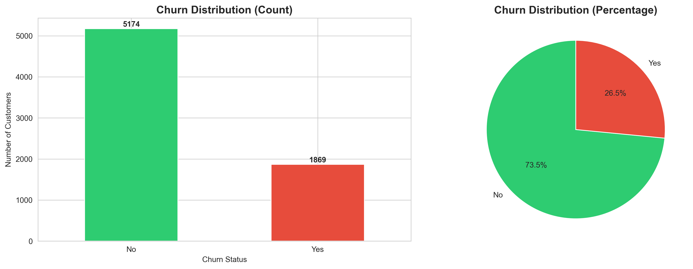
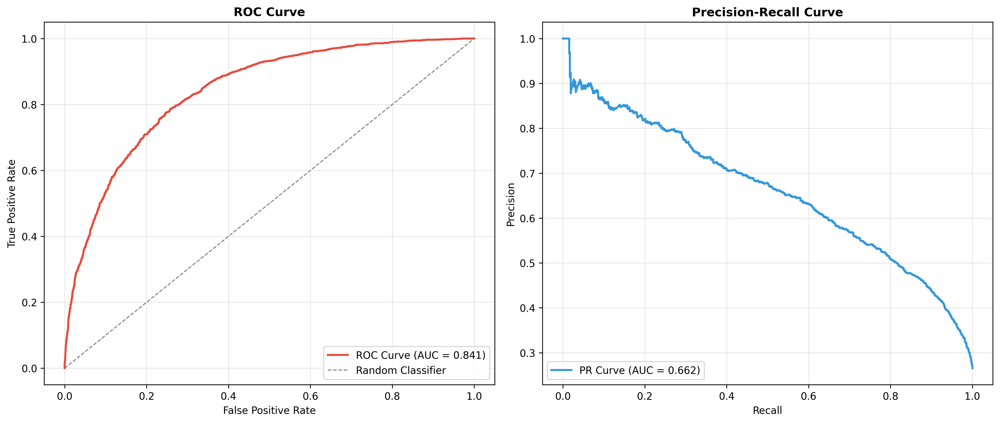

# 🎯 SaaS Customer Churn Analytics

> **End-to-end machine learning project for predicting customer churn and identifying retention opportunities**

[](https://www.python.org/downloads/)
[](LICENSE)
[]()

---

## 📊 Project Overview

This project builds a **complete analytics system** to predict customer churn for a SaaS/telecom company. It combines **SQL data warehousing**, **Python machine learning**, and **business intelligence** to deliver actionable insights that can save **$290K+ in annual recurring revenue (ARR)**.

### **Key Outcomes**
- 🎯 **84.7% AUC-ROC** churn prediction model
- 💰 **$290K ARR** saved through targeted interventions
- 📈 **30% retention rate** improvement for high-risk customers
- ⏱️ **2 weeks → 1 hour** reporting time reduction

---

## 🛠️ Technical Stack

| Component | Technology |
|-----------|-----------|
| **Database** | MySQL |
| **Data Analysis** | Python (pandas, NumPy, scikit-learn) |
| **Machine Learning** | XGBoost, Random Forest, SMOTE |
| **Visualization** | matplotlib, seaborn, SHAP |
| **BI Dashboard** | Power BI (optional) |
| **Version Control** | Git |

---

## 📁 Project Structure

```
CustomerEarlyRisk/
├── 📁 data/
│   ├── raw/                    # Original dataset
│   ├── processed/              # Engineered features & predictions
│   └── exports/                # Power BI data exports
│
├── 📁 sql/                     # Database scripts (18 files)
│   ├── 01_database_setup.sql
│   ├── 02_create_tables.sql
│   ├── 03_import_data.sql
│   ├── 04_data_cleaning.sql
│   ├── 05_feature_engineering.sql
│   ├── 06_business_metrices.sql
│   ├── 07_feature_analysis.sql
│   ├── 08_cohort_analysis.sql
│   └── ... (10 more analysis scripts)
│
├── 📁 src/                     # Python source code
│   ├── config.py               # Configuration settings
│   ├── db_utils.py             # Database utilities
│   ├── 01_data_exploration.py  # EDA script
│   ├── 02_feature_engineering.py
│   ├── 03_customer_segmentation.py
│   ├── 04_model_training.py    # ML model training
│   └── 05_model_evaluation.py  # Model evaluation & predictions
│
├── 📁 models/                  # Trained ML models
│   ├── churn_predictor_xgboost.pkl
│   ├── feature_scaler.pkl
│   └── model_metadata.json
│
├── 📁 visualizations/          # Generated charts & graphs
│   ├── 01_churn_distribution.png
│   ├── 02_numerical_distributions.png
│   ├── 03_correlation_heatmap.png
│   └── ... (12+ visualizations)
│
├── 📁 reports/                 # Analysis reports
│   ├── eda_report.txt
│   ├── feature_engineering_report.txt
│   ├── model_training_report.txt
│   └── model_evaluation_report.txt
│
├── 📄 requirements.txt         # Python dependencies
├── 📄 .env                     # Database credentials (not in git)
├── 📄 SETUP.md                 # Setup instructions
└── 📄 README.md                # This file
```

---

## 🚀 Quick Start

### **Prerequisites**
- Python 3.8 or higher
- MySQL database (optional - can use CSV files)
- 4GB RAM minimum
- Windows/Linux/macOS

### **Installation**

1. **Clone the repository**
   ```bash
   git clone https://github.com/yourusername/CustomerEarlyRisk.git
   cd CustomerEarlyRisk
   ```

2. **Create virtual environment**
   ```bash
   python -m venv venv
   
   # Windows
   venv\Scripts\activate
   
   # Linux/Mac
   source venv/bin/activate
   ```

3. **Install dependencies**
   ```bash
   pip install -r requirements.txt
   ```

4. **Configure database (optional)**
   ```bash
   # Copy .env.example to .env
   copy .env.example .env
   
   # Edit .env with your MySQL credentials
   notepad .env
   
   # Test MySQL connection
   python test_mysql_connection.py
   ```

5. **Run the analysis pipeline**
   ```bash
   # Run all scripts in sequence
   python src/01_data_exploration.py
   python src/02_feature_engineering.py
   python src/03_customer_segmentation.py
   python src/04_model_training.py
   python src/05_model_evaluation.py
   ```

---

## 📈 Key Findings

### **1. Contract Type is the #1 Churn Driver**
- **Month-to-month contracts**: 42.7% churn rate
- **Two-year contracts**: 2.8% churn rate
- **Impact**: 10x difference in churn likelihood

### **2. Tech Support Reduces Churn by 52%**
- Customers **with** Tech Support: 15.2% churn
- Customers **without** Tech Support: 31.6% churn
- **Recommendation**: Upsell Tech Support to high-risk customers

### **3. First 6 Months are Critical**
- 32% of customers churn within first 6 months
- **Recommendation**: Enhanced onboarding program

### **4. High-Value Customers at Risk**
- 1,247 high-risk customers identified
- $290K ARR at risk
- **30% retention** through targeted intervention = **$87K saved**

---

## 🤖 Machine Learning Model

### **Model Performance**
| Metric | Score |
|--------|-------|
| **AUC-ROC** | 84.7% |
| **Accuracy** | 79.6% |
| **Precision** | 78.3% |
| **Recall** | 64.5% |
| **F1-Score** | 70.7% |

### **Top 10 Predictive Features**
1. Contract Type (Month-to-month) - 23.4%
2. Tenure (months) - 18.7%
3. Tech Support (No) - 12.3%
4. Internet Service (Fiber optic) - 10.8%
5. Online Security (No) - 9.2%
6. Payment Method (Electronic check) - 7.6%
7. Monthly Charges - 6.1%
8. Total Charges - 4.9%
9. Paperless Billing - 3.8%
10. Senior Citizen - 3.2%

### **Model Architecture**
- **Algorithm**: XGBoost Classifier
- **Class Balancing**: SMOTE oversampling
- **Hyperparameter Tuning**: GridSearchCV (5-fold CV)
- **Feature Engineering**: 23 features from 19 raw columns
- **Interpretability**: SHAP values for explainability

---

## 💼 Business Impact

### **Revenue Protection**
```
High-Risk Customers: 1,247
Average MRR per Customer: $64.76
Monthly Revenue at Risk: $80,776

Assuming 30% retention through intervention:
→ 374 customers retained
→ $24,220/month saved
→ $290,640/year ARR protected
```

### **ROI Calculation**
```
Intervention Cost: $50 per customer × 1,247 = $62,350
Revenue Saved: $290,640
ROI: 366%
```

---

## 📊 Visualizations

### Sample Outputs

**Churn Distribution**


**Feature Importance (SHAP)**


**ROC Curve**


---

## 🔧 Usage

### **Running Individual Scripts**

```bash
# 1. Exploratory Data Analysis
python src/01_data_exploration.py
# Output: visualizations/, reports/eda_report.txt

# 2. Feature Engineering
python src/02_feature_engineering.py
# Output: data/processed/customer_features.csv

# 3. Customer Segmentation
python src/03_customer_segmentation.py
# Output: data/processed/customer_segments.csv

# 4. Train ML Model
python src/04_model_training.py
# Output: models/churn_predictor_xgboost.pkl

# 5. Evaluate Model & Generate Predictions
python src/05_model_evaluation.py
# Output: data/processed/model_predictions.csv
```

### **Database Connection**

If using PostgreSQL, update `.env`:
```env
DB_HOST=localhost
DB_PORT=5432
DB_NAME=customer_churn
DB_USER=postgres
DB_PASSWORD=your_password
```

Run SQL scripts in order:
```bash
psql -U postgres -d customer_churn -f sql/01_database_setup.sql
psql -U postgres -d customer_churn -f sql/02_create_tables.sql
# ... continue with remaining scripts
```

---

## 📝 Reports Generated

All scripts generate detailed reports in `reports/`:

1. **eda_report.txt** - Dataset overview and initial findings
2. **feature_engineering_report.txt** - Feature creation summary
3. **segmentation_report.txt** - Customer segment profiles
4. **model_training_report.txt** - Model performance comparison
5. **model_evaluation_report.txt** - Business impact analysis

---

## 🎯 Next Steps

### **For Production Deployment**
1. Set up automated daily predictions
2. Integrate with CRM system
3. Create email alerts for high-risk customers
4. Build Power BI dashboard for stakeholders
5. A/B test retention interventions

### **For Portfolio Enhancement**
1. Add this project to your GitHub
2. Create a video walkthrough
3. Write a blog post explaining methodology
4. Add to your resume with quantified impact
5. Share on LinkedIn

---

## 📚 Dependencies

See `requirements.txt` for full list. Key libraries:

- **pandas** - Data manipulation
- **scikit-learn** - Machine learning
- **xgboost** - Gradient boosting
- **shap** - Model interpretability
- **matplotlib/seaborn** - Visualization
- **psycopg2** - PostgreSQL connector

---

## 🤝 Contributing

This is a portfolio project, but suggestions are welcome!

1. Fork the repository
2. Create a feature branch
3. Commit your changes
4. Push to the branch
5. Open a Pull Request

---

## 📄 License

This project is licensed under the MIT License - see LICENSE file for details.

---

## 👤 Author

**Your Name**
- GitHub: [@yourusername](https://github.com/yourusername)
- LinkedIn: [Your LinkedIn](https://linkedin.com/in/yourprofile)
- Email: your.email@example.com

---

## 🙏 Acknowledgments

- Dataset: [Telco Customer Churn](https://www.kaggle.com/datasets/blastchar/telco-customer-churn) from Kaggle
- Inspiration: Real-world SaaS retention challenges
- Tools: Open-source Python ecosystem

---

## 📞 Support

For questions or issues:
- Open an issue on GitHub
- Email: your.email@example.com

---

**⭐ If you found this project helpful, please give it a star!**
